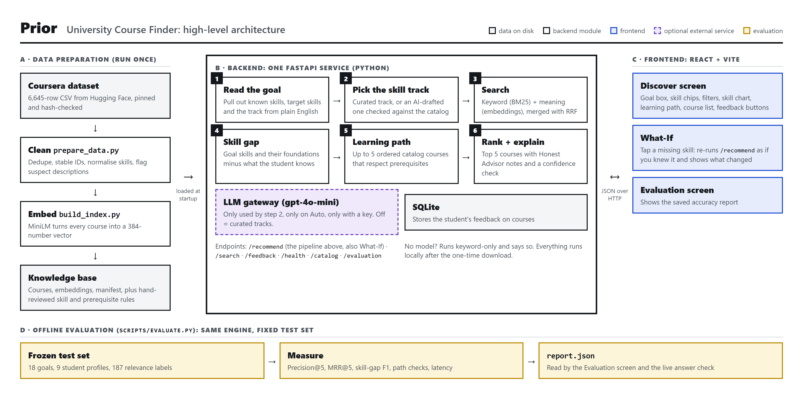

# Architecture overview and technology choices

This is the short version of how Prior is built. It has one simple diagram, a walk-through of it, and a list of every technology we used, what else we could have used, and why we picked what we did.

For the detailed diagram, see [architecture.pdf](architecture.pdf). For the full design reasoning, see [design.md](design.md).

The diagram is rendered from [architecture-overview.html](architecture-overview.html) with `node docs/render_architecture.mjs overview`.

---

## Part 1: The diagram explained

Prior has four parts. Two of them run when a student uses the app (B and C). The other two are scripts we run ahead of time (A and D).

### A. Data preparation (run once)

This part turns a raw spreadsheet of Coursera courses into something the app can search quickly.

1. **Coursera dataset.** A CSV of 6,645 courses downloaded from Hugging Face. `fetch_inputs.py` pins the exact version and checks its SHA-256 hash, so everyone gets identical data.
2. **Clean (`prepare_data.py`).** Removes duplicates, gives each course a stable ID taken from its URL, maps messy skill tags onto one vocabulary (for example "ML" and "Machine learning" become one skill), and flags 196 descriptions that don't match their course. Missing values stay missing: an unknown rating is not treated as 0.
3. **Embed (`build_index.py`).** Runs every course through the MiniLM language model, which turns it into a list of 384 numbers (an *embedding*). Courses about similar things get similar numbers, which is what makes search by meaning possible.
4. **Knowledge base.** The results are saved as plain files in `data/processed/`: courses, embeddings and a manifest of hashes. Next to them, `data/rules/` holds the hand-reviewed rules: skill aliases, three skill tracks and prerequisite links.

### B. Backend (one FastAPI service)

When the service starts, it loads the knowledge base into memory and checks the hashes. If the files don't belong together, it refuses to start.

Every search the student makes is a call to `POST /recommend`, which runs six steps:

| Step | What happens |
|---|---|
| 1. Read the goal | Rule-based parsing splits "I know Python and SQL, help me move into ML" into *known* skills (Python, SQL) and *target* (ML). Negation is respected: "I don't know Python" never counts as knowing it. |
| 2. Pick the skill track | A track is an ordered list of skills for a goal. We have three curated ones: machine learning, data analytics and cloud. With Track on Auto and an API key set, an LLM drafts a track for any goal. The draft is then checked against the real catalog, and skills no course teaches are dropped. |
| 3. Search | Two searches run on the same filtered courses. BM25 matches keywords, and embedding similarity matches meaning. RRF (Reciprocal Rank Fusion) merges the two ranked lists into one. |
| 4. Skill gap | Goal skills plus their foundations, minus what the student already knows, gives the missing skills. |
| 5. Learning path | A greedy loop picks up to 5 real catalog courses in an order that respects prerequisites. |
| 6. Rank + explain | Re-ranks the top 10 results so that courses the student is ready for come first, then returns the top 5. Each course comes with an Honest Advisor explanation (why it helps, what to know first, what to watch for) and an estimated confidence that it is relevant. |

Around this pipeline:
- **LLM gateway (optional).** Only step 2 uses it. Without a key, or with `PRIOR_LLM=off`, Auto falls back to the three curated tracks.
- **SQLite** stores the Relevant / Not relevant / Too advanced feedback that students give on courses.
- **Other endpoints:** `/search` (raw search, used by evaluation), `/feedback`, `/health`, `/catalog` (filter options) and `/evaluation` (the saved report).
- **Degraded mode.** If the model can't load, the service still runs with keyword search only, and says so everywhere.

### C. Frontend (React app)

- **Discover** is the main screen. It has the goal box, editable skill chips, filters, the periodic-table-style skill chart, the learning path and the course list with feedback buttons.
- **What-If.** Tapping a missing skill in the chart re-sends the same `/recommend` request as if the student already knew that skill, then shows what actually changed. If nothing changed, it says "No path change".
- **Evaluation** displays the saved accuracy report.

The frontend talks to the backend using JSON over HTTP. In development, Vite forwards `/api/*` to the backend on port 8100.

### D. Offline evaluation

`scripts/evaluate.py` runs the same engine against a fixed test set: 18 goals, 9 student profiles and 187 relevance labels. It measures search quality (Precision@5, MRR@5), skill-gap accuracy (F1), path correctness and speed, and writes `report.json`. The Evaluation screen reads this file. The live "Answer check" on each result also uses it.

### One request, end to end

> Student types *"I know Python and SQL. Help me move into machine learning."*
>
> React sends it to `/recommend` → the parser marks Python and SQL as known → the ML track is picked → BM25 and MiniLM each return their top 50, and RRF merges them → the gap is Machine Learning, Regression and Deep Learning, plus the foundations Calculus, Linear Algebra and Statistics → the path picks courses in learning order → the top 5 come back with explanations → React draws the chart, the path and the course cards.

---

## Part 2: Technologies used, alternatives, and why

### Quick list

| Area | What we used |
|---|---|
| Data | Coursera dataset (Hugging Face, pinned), pandas, JSON + NumPy files, SHA-256 manifest |
| Backend | Python 3.13, FastAPI, Uvicorn, Pydantic, httpx |
| Keyword search | BM25 (`rank-bm25`, BM25Okapi) with our own tokenizer (stop words, light stemming) |
| Semantic search | `all-MiniLM-L6-v2` via `sentence-transformers`, CPU-only PyTorch, exact cosine similarity in NumPy |
| Combining searches | Reciprocal Rank Fusion (k = 60), semantic similarity floor of 0.30 |
| Understanding the goal | Regex-based clause and polarity parser |
| Skills and prerequisites | Hand-curated JSON skill graph with a cycle check at startup, prerequisites labelled with their source |
| Learning path | Greedy, deterministic algorithm |
| AI-drafted tracks | gpt-4o-mini through the course LLM gateway, validated against the catalog, cached per goal |
| Explanations | Templates filled from data (Honest Advisor) |
| Confidence | Small logistic regression written in NumPy, checked with leave-one-query-out cross-validation |
| Feedback storage | SQLite |
| Frontend | React 19, TypeScript, Vite 8, plain CSS with design tokens, Phosphor icons, Archivo font, oxlint |
| Testing | pytest, FastAPI TestClient (httpx) |
| Evaluation | Pooled blind relevance judging, Precision@5, MRR@5, P/R/F1, path checks |
| Docs tooling | playwright-core + local Chrome to render the diagrams |

The rest of this part goes through each one.

### Data

**Coursera dataset from Hugging Face (`azrai99/coursera-course-dataset`)**
- *Alternatives:* scraping Coursera ourselves, Kaggle Coursera datasets, edX/Udemy APIs, a university's own course list.
- *Why:* it's a public, ready-made snapshot with skills, ratings and descriptions, and Hugging Face lets us pin an exact revision. Scraping would break when the site changes and raises terms-of-service questions. Because the version is pinned and hash-checked, every label and rule in the project always refers to the same data.

**pandas for cleaning**
- *Alternatives:* Polars, Python's built-in `csv` module.
- *Why:* 6,645 rows is tiny, so speed doesn't matter. pandas is the best-known tool and is good at messy CSV parsing. Polars would be faster but offers nothing we need at this size.

**Plain JSON and NumPy files instead of a database**
- *Alternatives:* PostgreSQL, SQLite for the catalog, MongoDB.
- *Why:* the catalog is read-only and small enough to load into memory in full. Files are easy to inspect, version and diff. The manifest of hashes gives us the one guarantee a database would, that the pieces belong together, without any setup.

### Backend

**Python**
- *Alternatives:* Node.js/TypeScript, Java, Go.
- *Why:* the ML libraries we need (sentence-transformers, PyTorch, NumPy, BM25) are Python-first. Any other language would need a separate Python service anyway.

**FastAPI + Uvicorn + Pydantic**
- *Alternatives:* Flask, Django / Django REST Framework, Litestar. For servers: Gunicorn, Hypercorn.
- *Why:* FastAPI validates every request and response through Pydantic models, so bad input (empty goals, ratings outside 0-5) is rejected with clear messages without hand-written checks. It also generates API docs at `/docs` for free. Flask would need extra libraries for validation and docs, and Django brings an ORM, admin and auth that we don't use. Uvicorn is the standard server for FastAPI.

**httpx (for LLM calls and tests)**
- *Alternatives:* requests, aiohttp, the OpenAI SDK.
- *Why:* FastAPI's test client already depends on it, so using it for the LLM call adds no new dependency. It's a plain HTTP POST, so a vendor SDK would add weight without adding anything useful.

### Search

**BM25 keyword search (`rank-bm25`)**
- *Alternatives:* TF-IDF, Elasticsearch / OpenSearch, SQLite FTS5, Whoosh / Tantivy, learned sparse retrieval (SPLADE).
- *Why:* BM25 is the standard keyword-ranking formula and does better than plain TF-IDF on documents of different lengths. `rank-bm25` is a small pure-Python library that builds the index in memory when the service starts. Elasticsearch would do the same thing but needs its own server (Java, memory, config) for a catalog that fits in RAM. We kept keyword search because it catches exact tool names like "Tableau", "Power BI" or "TensorFlow" that embeddings can blur.

**Our own tokenizer (stop words + strip plural "s")**
- *Alternatives:* NLTK Porter/Snowball stemmer, spaCy lemmatizer.
- *Why:* course text is short and technical. Full stemmers like Porter chop technical words down to stems that can collide or become unrecognisable, and we need to keep tokens like `c++`, `c#` and `r` intact. A ten-line tokenizer that only drops stop words and a trailing plural "s" does what we need with no dependency.

**`all-MiniLM-L6-v2` embeddings (sentence-transformers)**
- *Alternatives:* larger open models (`all-mpnet-base-v2`, `bge-base`, `e5-base`, `gte-base`), other small models (`bge-small`, `e5-small`), hosted APIs (OpenAI `text-embedding-3`, Cohere, Voyage).
- *Why:* it's small (about 90 MB), fast on a normal CPU, produces compact 384-number vectors, and is one of the most widely used and tested sentence models. Once downloaded it works offline, and we pin its revision so results don't drift. Hosted APIs cost money per call, need the internet and change without notice. Bigger models might be a little more accurate but are slower to load and run. On our test set, semantic search with MiniLM already reached Precision@5 of 0.87.

**CPU-only PyTorch**
- *Alternatives:* the full CUDA build, ONNX Runtime.
- *Why:* the CPU build is a much smaller download and nobody needs a GPU to run the demo. ONNX Runtime would load faster, but it adds a conversion step and another thing that can go wrong.

**Exact cosine similarity in NumPy (no vector database)**
- *Alternatives:* FAISS, Chroma, Qdrant, Pinecone, pgvector, HNSW libraries (hnswlib, Annoy).
- *Why:* 6,642 × 384 numbers is about 10 MB. Comparing a query against all of them takes a few milliseconds and always finds the true best matches. Vector databases and approximate indexes are built for millions of items. Here they would add setup and trade away exact answers for no measurable gain.

**Reciprocal Rank Fusion (RRF, k = 60) to merge the two searches**
- *Alternatives:* a weighted sum of normalised scores, using one channel only, a cross-encoder re-ranker, learning-to-rank.
- *Why:* BM25 scores and cosine similarities are on completely different scales, so adding them needs tuning. RRF only looks at *rank positions*, so it needs no calibration. k = 60 is the value from the original paper and a common default. A cross-encoder would probably improve ranking but costs a second model and more latency.
- *Honest note:* on the held-out test queries, semantic-only search had better Precision@5 (0.87 vs 0.75), while hybrid had the best MRR@5 (0.90, meaning it most often puts a relevant course first). We kept hybrid because it was the planned design, and switching after seeing test results would be tuning on the test set. Weighting the two channels is the first thing to try with new test queries.

**Semantic floor of 0.30**
- *Alternatives:* no floor (always return the top 5), a learned threshold.
- *Why:* without a floor, an unrelated goal like "learn to bake bread" would still return the "least bad" tech courses. With the floor it returns nothing, which is the honest answer. The value was set on development queries only.

### Understanding the student

**Rule-based goal parser (regex)**
- *Alternatives:* spaCy with custom patterns or NER, a zero-shot classifier, asking an LLM to extract skills.
- *Why:* it's instant, deterministic and fully explainable ("Python is marked known because of the phrase *I know*"), and it handles negation predictably. An LLM parser would understand more phrasings but could give different answers on each run and needs a network connection. The trade-off is real: the evaluation found two phrasings it misses ("I studied calculus at school", "networking" as a bare word). Students can always fix mistakes by editing the skill chips.

**Hand-curated skill graph (JSON) with a cycle check**
- *Alternatives:* standard skill taxonomies (ESCO, O*NET, Lightcast), a graph database (Neo4j), networkx, generating everything with an LLM.
- *Why:* 21 skills and 13 dependencies, each with a written reason, is small enough to review line by line and defend. Public taxonomies are huge and describe jobs rather than learning order. A graph database is far too much for a graph this size; a plain dictionary plus a cycle check at startup covers it.

**Prerequisites labelled by source** ("course description", "curated guidance", "not verified")
- *Alternatives:* extracting prerequisites automatically from descriptions with NLP or an LLM.
- *Why:* automatic extraction without review is unreliable. We'd rather say "not verified" than invent a prerequisite.

**Greedy learning-path algorithm**
- *Alternatives:* integer linear programming or set-cover optimisation (shortest path), graph search (A*, Dijkstra), a plain topological sort of skills.
- *Why:* greedy can explain every step ("step 2 because it builds on step 1"), always gives the same answer and is fast. An optimiser might find a shorter path now and then, but it can't explain why it chose one. A topological sort orders *skills*, not *courses*, so on its own it can't pick courses. The known downside is that greedy can occasionally produce a longer path, and What-If shows this honestly when it happens.

### AI

**gpt-4o-mini through the course LLM gateway, only for drafting skill tracks**
- *Alternatives:* no LLM at all (curated tracks only), a different hosted model (Claude, Gemini, larger GPT models), a local model (Llama or Qwen through Ollama), using the LLM for everything (chat, explanations, ranking).
- *Why:* with only three curated tracks, most goals got no skill chart. An LLM can draft a track for any goal. We use it in the narrowest possible way: it only suggests skill names, an order and keywords, and everything after that is checked against the real catalog. gpt-4o-mini is cheap and fast, and it's the model the gateway serves. A local model would work offline but needs several GB and a decent machine. Drafts are cached per goal, so What-If toggles never wait on the model, and the app runs normally without a key.

**Templated explanations instead of LLM-written ones**
- *Alternatives:* have an LLM write each "why this course" paragraph.
- *Why:* every sentence a student reads can be traced to a catalog field or a rule. LLM text reads better but can confidently claim things that aren't true about a course. For advice about what to study, that risk isn't worth it.

**Calibrated confidence: small logistic regression written in NumPy**
- *Alternatives:* showing the raw score as a percentage, isotonic regression, scikit-learn's `LogisticRegression`, no confidence at all.
- *Why:* raw similarity scores are not probabilities, and showing "95% match" would mislead. A 3-feature logistic regression (fitted with Newton's method, L2-penalised) trained on our 187 labels gives a real estimated probability, and we measure its quality on queries it didn't see (leave-one-query-out cross-validation). The fit is about 15 lines of NumPy, so adding scikit-learn just for this wasn't worth it. Isotonic regression needs more data than 187 labels to be stable. The confidence only annotates results and never changes the ranking.

### Storage

**SQLite for feedback**
- *Alternatives:* PostgreSQL, MongoDB, appending to a JSON file.
- *Why:* it's built into Python, needs no server, is safe with several writes happening at once, and is a single file. PostgreSQL would be the choice for a multi-user deployment, but not for a local demo. A JSON file gets corrupted if two writes overlap.

### Frontend

**React 19 + TypeScript**
- *Alternatives:* Vue, Svelte, Angular, plain HTML and JavaScript.
- *Why:* React has the biggest ecosystem and is the most widely known. TypeScript types in `types.ts` mirror the backend's Pydantic schemas, so the compiler catches frontend code that misuses a field of the API response.

**Vite**
- *Alternatives:* Next.js, Create React App (deprecated), webpack, Parcel.
- *Why:* fast dev server, simple config, and a built-in proxy to the backend. Next.js adds server-side rendering and file routing, which a two-screen local app doesn't need.

**No router or state library** (a small hash-based `useRoute` hook, React hooks for state, `AbortController` to cancel outdated requests)
- *Alternatives:* React Router, TanStack Router, Redux, Zustand, TanStack Query.
- *Why:* with only two screens, a 20-line hook is enough. Using `AbortController` directly is how quick What-If toggles avoid showing stale results, and it's fewer moving parts than a data-fetching library.

**Plain CSS with design tokens, custom skill chart**
- *Alternatives:* Tailwind, a component library (MUI, Chakra, shadcn/ui), CSS-in-JS, a charting library (Recharts, D3).
- *Why:* the skill chart is a custom periodic-table layout that no chart library offers, and plain CSS with variables handles light and dark themes easily. A component library would make the app look generic and add weight.

**Phosphor icons, Archivo font (self-hosted via Fontsource)**
- *Alternatives:* Lucide, Heroicons, Material Icons; Google Fonts CDN.
- *Why:* Phosphor has consistent icon weights. Self-hosting the font means the app still looks right offline.

**oxlint**
- *Alternatives:* ESLint.
- *Why:* much faster, needs almost no config, and covers the rules we care about.

### Testing and evaluation

**pytest + FastAPI TestClient**
- *Alternatives:* unittest, calling a running server with requests.
- *Why:* pytest is the Python standard, and TestClient runs the whole API in-process with no network. The suite also runs with Hugging Face offline mode forced on, which proves the app works without internet.

**Pooled blind judging + Precision@5, MRR@5, P/R/F1**
- *Alternatives:* nDCG, Recall@k, A/B tests with real users, click-through data, LLM-as-judge at scale.
- *Why:* the app shows 5 results, so Precision@5 ("how many of the 5 are relevant") and MRR@5 ("how high is the first good one") match what the student actually sees. Pooling the top 5 of all three search methods and hiding which method found each course keeps the judging fair. nDCG needs graded relevance (0-3), and we used a simple yes/no rule. We don't have real users, so A/B tests and click data weren't possible. Test queries were frozen before any results were seen, and nothing was tuned on them afterwards.

**playwright-core + local Chrome (docs only)**
- *Alternatives:* Puppeteer, Selenium, drawing the diagrams in draw.io or Figma.
- *Why:* it drives the Chrome already installed without downloading another browser. Keeping the diagrams as HTML means they live in the repo, can be diffed, and are rebuilt with one command.

---

## The common thread

Most choices follow the same three rules:

1. **Use the smallest thing that works at this size.** The catalog is 6,642 courses, so there's no vector database, no Elasticsearch, no second service and no ORM.
2. **Keep every answer traceable.** Templates instead of generated text, reviewed rules, labelled prerequisite sources, and an LLM limited to one checked job.
3. **Work offline and give the same result every time.** Pinned data and model versions, hash-checked files, local inference, deterministic tie-breaking and a graceful fallback when something is missing.
