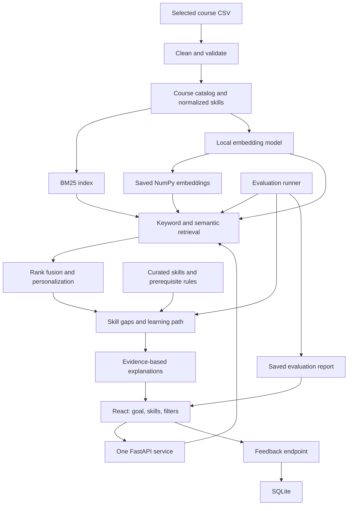

# University Course Finder — Implementation Plan

> **Goal:** Turn “What should I learn next?” into relevant courses, clear skill gaps, and a short learning path the student can understand and change.
>
> **Build:** One React application, one FastAPI service, local search indexes, and SQLite for feedback.
>
> **Standout features:** Honest Advisor explanations and a What-If skill toggle.
>
> **Current state (28 September 2026, session 2):** M0–M5 done and verified; M6 evaluation complete and awaiting the author's review of the relevance labels; M7 documentation written, with the panel rehearsal still to do. See the tracker in section 8.

**How to use this document:** For a presentation, focus on sections 1, 4, 6, and 12. Agents should use the tracker and milestone checklists in sections 8–9, with the remaining sections as implementation reference.

## 1. The project in two minutes

A student enters: **“I know Python and SQL. Help me move into machine learning.”** They can correct the detected skills and choose filters. The application returns:

1. Five relevant courses with real catalog information.
2. Skills they already have and skills they still need.
3. A short, ordered learning path, including foundational courses where necessary.
4. An explanation of each recommendation and any concerns.
5. A What-If control: **“What changes if I already know Statistics?”**

The student can submit feedback. An evaluation screen shows measured results from the same search engine used by the application.

**Scope boundary:** Search the whole imported catalog. Initially support detailed skill-gap analysis and learning paths for **machine learning, data analytics, and cloud computing**, provided the inspected dataset supports them. Other goals still receive search results, with a clear message when a structured path is unavailable. Do not claim complete career guidance across every subject.

The 20 minutes refers to explaining and demonstrating the project, not its implementation time. The original brief requires **8 minutes of presentation/demo plus 2 minutes of questions**; both presentation formats are included below.

## 2. Review of the original PDF

Reviewed: `problem statement.txt` and all 42 pages of `Intelligent Course Discovery System.pdf`, including the architecture images on pages 4–8. The PDF has a sound core, but its many pages, endpoints, and optional features would make the first version harder to finish and explain.

| PDF proposal | Decision for this implementation |
|---|---|
| BM25 + sentence embeddings + Reciprocal Rank Fusion, pp. 2–3, 15–18 | Keep. This is the main retrieval approach. |
| React, FastAPI, NumPy, SQLite | Keep. Use one backend service with ordinary Python modules. |
| Description validation and skill normalization, pp. 11–14 | Keep. Bad metadata directly damages recommendations. |
| Shared skill model and explicit prerequisite sources, pp. 19–24 | Keep. Search explanations, paths, and What-If must agree. |
| Honest Advisor and What-If, pp. 23–25 | Keep as the two signature features. |
| Nine UI destinations, pp. 28–29 | Reduce to **Discover** and **Evaluation**. Put the profile, gaps, and path on Discover. |
| Numerous separate analysis/simulation endpoints, pp. 30–32 | Use one `/recommend` operation for the complete result and What-If recalculation. |
| Interactive graph, alternatives, course comparison | Stretch work after the core passes verification. Start with a readable path timeline. |
| Optional LLM and API fallback, pp. 30, 38 | Defer the LLM entirely. Local retrieval and template explanations are sufficient. |
| Elasticsearch, feature stores, streaming, model registries in reference diagrams, pp. 4–8 | Treat these as reference illustrations. They are unnecessary for this implementation. |
| Evaluation alongside development | Keep. Prepare judgments early and report actual outcomes. |

### Assumptions that must be corrected

- The PDF refers to `coursera_course_dataset_v3.csv` and `coursera_course_dataset_v2_no_null.csv`, each with 623 rows. Neither file is currently in the project folder. Their counts, columns, and alleged description mismatches are **unverified claims from the PDF**, not findings from this review.
- The linked Hugging Face dataset currently displays about **6.65k rows**, so it must not be silently treated as the same snapshot. Select and record the actual input file before implementation. [Dataset viewer](https://huggingface.co/datasets/azrai99/coursera-course-dataset)
- The original brief does not require two input files. Use one documented primary CSV; inspect a second only if it is supplied and useful. Do not merge unrelated snapshots by row position.
- Course skills describe subject coverage; they do **not** automatically establish prerequisites or prove student mastery. A curated learning dependency is a recommendation, not an official university requirement.

## 3. Required scope and grading coverage

| Assignment task | Weight | What we will deliver | Milestones |
|---|---:|---|---|
| Data preparation and knowledge base | 20% | Reproducible cleaning, data-quality report, normalized skills, searchable catalog and embeddings | M1 |
| Semantic search and recommendation | 25% | Natural-language hybrid search, filters, personalized ranking, factual explanations | M2–M4 |
| Skill gaps, prerequisites, learning paths | 25% | Editable profile, missing skills, sourced dependencies, ordered courses, honest coverage gaps | M3–M5 |
| Evaluation, personalization, application | 20% | Working React UI, retrieval/path evaluation, SQLite feedback | M4–M6 |
| Architecture, documentation, demonstration | 10% | Executable FastAPI service, README, design notes, architecture JPEG/PDF, rehearsed demo | M0, M7 |

### Build priorities

**Required:** Data cleaning; hybrid search; difficulty, organization, and minimum-rating filters; editable known skills; skill gaps; prerequisite information; learning paths; explanations; feedback; evaluation; documentation.

**Demo finish line:** All required items plus What-If, polished Honest Advisor cards, and a compact coverage indicator derived from the same skill data.

**Stretch, in order:** A small clickable skill graph; comparison of two courses; saved courses in browser storage. Stop after one stretch feature unless the demo is already reliable.

**Deferred:** Accounts, authentication, social features, chatbot conversations, paid AI APIs, model fine-tuning, automatic retraining, multiple backend services, cloud deployment, vector databases, live course scraping, and a large analytics dashboard. None is needed to satisfy the brief.

## 4. Simple architecture and stack



The backend is the executable microservice requested in the brief. The boxes inside it are modules, not separately deployed services. Export a project-specific version of this diagram to JPEG or PDF for submission.

| Area | Choice | Purpose |
|---|---|---|
| UI | React + Vite + TypeScript | Two screens and reusable components |
| Styling | Plain CSS with shared colors, spacing, and reusable controls | Avoid a separate component-system project |
| API | FastAPI + Pydantic | Typed requests, validation, generated API documentation |
| Data | pandas | CSV inspection and cleaning |
| Retrieval | `rank-bm25`, Sentence Transformers, NumPy | Keyword search, embeddings, cosine similarity |
| Embedding model | `sentence-transformers/all-MiniLM-L6-v2` initially | Small local starting point; validate its relevance on our queries |
| Persistence | JSON/NumPy files and Python `sqlite3` | Catalog/index artifacts and feedback |
| Checks | pytest, FastAPI test client, frontend build, manual browser scenarios | Verify behavior that matters |

Pin tested dependency versions and the model revision during M0/M1. The proposed model produces 384-dimensional vectors and truncates inputs beyond 256 word pieces by default; put title and skills first, then fit validated description text into the remaining token budget. [Model card](https://huggingface.co/sentence-transformers/all-MiniLM-L6-v2)

Direct similarity search is the initial choice for this small catalog; measure it before adding infrastructure. [Sentence Transformers semantic-search documentation](https://www.sbert.net/examples/sentence_transformer/applications/semantic-search/README.html)

### Target repository structure

```text
kavini/
  implementation-plan.md
  README.md
  backend/
    app/
      main.py          # Routes, startup, health
      schemas.py       # Shared request/response contracts
      catalog.py       # Load courses and index artifacts
      search.py        # BM25, embeddings, RRF
      recommend.py     # Personalization and explanations
      skills.py        # Normalization, targets, dependencies
      learning_path.py # Ordered course selection
      feedback.py      # SQLite persistence
    scripts/           # Inspect, prepare, index, evaluate
    tests/
    requirements.txt
  frontend/
    src/
      components/
      pages/           # Discover and Evaluation
      api.ts
      App.tsx
    package.json
  data/
    raw/               # Unmodified source snapshot
    processed/         # Courses, embeddings, manifest
    rules/             # Aliases, goals, prerequisite rules
    evaluation/        # Queries, judgments, profile cases
  docs/                # Data quality, design, evaluation, demo
```

Create modules when needed. Downloaded model files and runtime databases stay out of Git; document their locations and how to recreate them.

## 5. Data and recommendation rules

### 5.1 Prepare a trustworthy catalog

Use the brief's supplied CSV if available. Otherwise obtain and freeze one snapshot from its listed sources, starting with the [primary Kaggle dataset](https://www.kaggle.com/datasets/azraimohamad/coursera-course-data) or the inspected Hugging Face alternative. Record source URL, filename, download date, file hash, row count, and observed columns. Do not invent a 623-row subset to match the PDF.

Map source columns to this canonical record:

| Field | Rule |
|---|---|
| `course_id` | Stable hash of canonical URL; otherwise normalized organization + title, with collision handling |
| `title`, `organization` | Clean whitespace; title required; preserve source values for traceability |
| `description` | Text or null; never invent a replacement |
| `skills` | Deduplicated canonical skill names; empty when unavailable |
| `difficulty` | Beginner, Intermediate, Advanced, Mixed, or Unknown |
| `rating` | Number from 0–5 or null; missing does not mean zero |
| `duration_text`, `course_type`, `course_url` | Preserve available values; unknown stays null |
| `description_quality` | Unreviewed, Reviewed, Suspect, or Missing |
| `source_ref` | Input filename and source row identifier |

Clean duplicate URLs and exact duplicate records; review conflicting records before combining them. Safely parse string-encoded skills using JSON or a safe literal parser, never `eval`. Keep related concepts separate: general programming is not automatically Python.

Review suspicious title/description pairs and all courses selected for the demo. Keep a small overrides file with reasons. Use title and skills when a description is missing or suspect; do not let rejected descriptions affect either search channel. Retain usable incomplete courses with visible metadata limitations.

Save `courses.json`, `embeddings.npy`, the ordered course IDs, and an index manifest containing the source hash, preprocessing version, model revision, and embedding text recipe. Check their consistency at startup. Rebuild when source data or the recipe changes.

### 5.2 Search and personalize

1. Read the student's goal, confirmed skills, and filters. Recognize simple phrases such as “I know Python”; display inferred skills as editable chips. Explicit profile corrections take precedence. “I don't know Python” must not mark Python as known.
2. Apply hard filters to the eligible catalog before selecting results. Unknown ratings or difficulty do not satisfy an explicit minimum or exact filter.
3. Run BM25 and cosine similarity over eligible courses. Retrieve up to 50 candidates from each channel, or fewer if the catalog is smaller. Encode the query with the same pinned model used for courses.
4. Exclude zero-evidence keyword hits. Choose a conservative semantic relevance threshold using development queries; record it and test unrelated queries. Similarity is not a probability of suitability.
5. Fuse ranks: `RRF(course) = sum(1 / (60 + rank))`, with ranks starting at 1 and absent-channel contributions equal to zero. Deduplicate by course ID. The constant 60 is a starting configuration, not a proven optimum.
6. For recommendations, personalize only the top 10 relevant fused candidates: prefer satisfied modeled prerequisites, then unknown prerequisites, then unmet prerequisites; within each group prefer coverage of missing target skills, then fused rank. Use rating only as a final tie-breaker, followed by stable course ID.
7. Return up to five courses. It is acceptable to return fewer or none. Explain which filters limited the result and let the user change them.

Keep unpersonalized BM25, semantic, and hybrid modes available to the evaluation runner. Do not label raw fusion scores as “95% match.” A course can be relevant to a goal while still being too advanced; the explanation should make that distinction visible.

### 5.3 Skill gaps and prerequisites

Use three small, readable rule files:

- `skill_aliases.json`: equivalent labels, such as “Python Programming” → “Python.”
- `goal_skills.json`: target skills and prerequisite relationships for the three supported tracks, grounded in catalog coverage and manual review.
- `course_prerequisites.json`: reviewed requirements for path candidates, with `course_id`, required skills, source type, and evidence/reference.

Every prerequisite relation must identify its source: **explicit course metadata** or **curated learning guidance**. Unreviewed prerequisites remain **unknown**, not “none.” Automated prerequisite extraction from descriptions is deferred.

For a supported goal:

```text
target_skills = curated skills for the selected goal
required_skills = target_skills plus their prerequisite closure
missing_skills = required_skills minus confirmed_known_skills
```

Separate target gaps from supporting prerequisites in the UI. If the query maps ambiguously to multiple tracks, let the student select the intended track. For unsupported tracks, return search results and an unavailable-path message instead of fabricated skill advice.

### 5.4 Build the learning path

Use a deterministic greedy algorithm; no optimization framework is necessary.

1. Validate that the curated skill dependencies contain no cycles.
2. Start with the student's confirmed skills as `covered` and no selected courses.
3. Find missing skills whose dependencies are covered. Retrieve courses for those skills from the **whole filtered catalog**, not only the five displayed goal-search results.
4. Prefer reviewed courses whose explicit or curated course prerequisites are covered. An unknown prerequisite state may be shown as an advisory option, with that uncertainty retained in the response.
5. Choose a course that covers the most currently learnable missing skills; break ties by relevance, suitable difficulty, then stable course ID. It must add at least one missing skill and must not already be selected.
6. Add its taught skills to projected coverage and repeat, stopping at five courses, full coverage, or no progress.
7. Return remaining uncovered or blocked skills and the reason. Never invent a course or quietly relax filters to make a complete-looking path.

A course teaching both a prerequisite and its dependent skill needs manual review of the within-course progression before it can satisfy both in one step. Listing a taught skill does not prove that the student must know it before enrollment.

Use dependency order first and difficulty as supporting evidence. Do not force an Advanced course into every path. Label accumulated skills as **projected coverage after the path**, not skills already mastered. Test zero-gap profiles, cycles, missing foundation courses, and courses that cover multiple skills.

## 6. The two standout features

### Honest Advisor

Each course card has a short expandable panel:

- **Why this helps:** Matching topic and missing skills actually listed for the course.
- **Before you start:** Known prerequisites, their source, or “Prerequisites not verified.”
- **Things to consider:** Difficulty mismatch, missing metadata, or substantial overlap with known skills.

Generate these sentences from the recommendation response, using templates. Never claim a course guarantees a job or that catalog skill tags demonstrate mastery. A relevant concern is more useful than an unexplained score.

**Demo moment:** Open a machine-learning recommendation and show why it fits and which foundation the student still needs.

### What-If skill toggle

Keep `confirmed_skills` separate from `simulated_skills`. Call the same `/recommend` pipeline with their union for the simulation, while retaining the original response as the baseline.

Show baseline versus simulated missing skills, path steps, and target-skill coverage. Highlight added/removed course IDs. Provide **Reset simulation**. Toggling a skill does not have to shorten every path; display the actual change, including “No path change.”

Cancel or ignore older responses when users toggle quickly. Keep simulations out of the confirmed profile. Reuse the existing path timeline; a graph library is not needed for this feature.

**Demo moment:** Add Statistics temporarily, show the changed gaps/path, then reset and recover the original result.

The coverage indicator is `target skills covered / total target skills`, with separate current and projected values. Display counts as well as a bar; this is curriculum coverage, not a competence score.

## 7. API contract and user interface

Agree on these contracts during M0 before separate agents implement them.

| Endpoint | Purpose |
|---|---|
| `GET /health` | Model/index readiness, mode, and data version |
| `GET /catalog` | Available skills, supported goal tracks, and filter choices |
| `POST /search` | BM25, semantic, or hybrid retrieval for evaluation and debugging |
| `POST /recommend` | Complete recommendations, gaps, prerequisites, path, explanations; reused for What-If |
| `POST /feedback` | Persist Relevant, Not relevant, Too advanced, Too basic, or Already learned feedback |
| `GET /evaluation` | Read the latest saved evaluation report; do not trigger model work from the UI |

Illustrative request:

```json
{
  "goal": "I want to move into machine learning",
  "goal_track": "machine_learning",
  "known_skills": ["Python", "SQL"],
  "simulated_skills": [],
  "filters": {"difficulty": null, "organization": null, "min_rating": null},
  "top_k": 5
}
```

The response contract must contain:

- `request_id`, `data_version`, `mode`, and `is_simulation`.
- `profile`: interpreted track, confirmed/simulated skills, and corrections or warnings.
- `courses`: IDs, display metadata, taught skills, reasons, concerns, prerequisite source/status.
- `skill_gap`: target skills, supporting prerequisites, known skills, and missing skills.
- `learning_path`: ordered courses, newly covered skills per step, projected coverage, and unresolved gaps.
- `warnings`: unsupported track, insufficient matches, incomplete path, or degraded retrieval.

Reject empty goals, invalid ratings/enums, and excessive inputs with useful validation messages. Bound goal/comment length and `top_k` (1–10). Feedback stores the course ID, request/profile context, selected label, optional comment, and timestamp in SQLite using parameterized statements. Feedback informs later analysis; it does not silently retrain ranking.

**Discover screen:** Goal input and three example prompts at the top; editable skill chips and compact filters; recommendation cards; known/missing skills; a numbered learning-path timeline; What-If controls. Place feedback on each recommendation card.

**Evaluation screen:** One comparison table for the three search methods, skill/path checks, latency, and report date/dataset version. Plain tables are enough; skip a chart library initially.

Show loading, empty, unavailable, success, and retry states. Controls must work by keyboard and have labels. Use text/icons alongside color. On smaller screens, stack results and the path vertically.

## 8. Agent progress tracker

**Last updated:** 28 September 2026 (session 2)  
**Implementation progress:** 6 of 8 milestones DONE, 2 in REVIEW (milestone count, not effort-weighted)  
**Planning:** Source review and implementation plan complete  
**Next action:** Author reviews `data/evaluation/judgments.json` (187 labels by an AI judge) and the manual path review in `docs/evaluation.md`; then rehearse the 10-minute panel with `docs/demo-script.md`  
**Known dependency:** None blocking. The dataset snapshot and model are pinned and downloadable with `backend/scripts/fetch_inputs.py`

Status values: `TODO`, `IN_PROGRESS`, `BLOCKED`, `REVIEW`, `DONE`. Owners below are suggested roles, not assignments to running agents. One agent may handle all roles sequentially.

| ID | Milestone | Suggested role | Depends on | Claimed by | Status | Evidence / blocker |
|---|---|---|---|---|---|---|
| M0 | Scaffold and contracts | Integrator | — | Claude (sessions 1–2) | DONE | `/health` ok (hybrid, 6,642 courses); the React top bar shows the real health response through the `/api` proxy (headless Chrome); `schemas.py` and `types.ts` agree; frontend build passes |
| M1 | Data and indexes | Data/backend | M0 | Claude (sessions 1–2) | DONE | 6,645 rows in, 6,642 courses out (3 exact duplicates); embeddings 6642x384; identical sha256 on re-run; 18 representative queries in `data/evaluation/queries.json`; fresh download matches the pinned CSV hash |
| M2 | Search and ranking | Recommendation/backend | M1 | Claude (sessions 1–2) | DONE | Three modes through one engine; 187 blind pooled labels; test P@5 BM25 0.63 / semantic 0.87 / hybrid 0.75, MRR@5 0.75 / 0.83 / 0.90; paraphrase, negation, empty, restrictive-filter and unrelated cases checked |
| M3 | Skills, paths, explanations | Recommendation/backend | M2 | Claude (sessions 1–2) | DONE | 9 profiles: gap F1 0.98, 7/9 exact; paths 100% target coverage, 0 duplicates, 0 modelled-prerequisite violations; pytest covers cycles, missing foundations, already-covered tracks |
| M4 | Complete application and feedback | UI/integrator | M3 | Claude (session 2) | DONE | Headless-Chrome journey: goal → chart/path → advisor → feedback saved → What-If → reset → chip removal → filter → Evaluation; no console errors; no horizontal overflow from 390 to 1920 px; feedback row survived a backend restart |
| M5 | What-If and presentation polish | UI/integrator | M4 | Claude (session 2) | DONE | Add/remove/reset verified; confirmed chips unchanged; "No path change" shown for a real unchanged case; 4 rapid toggles end on the API's result for the final state; keyboard toggling works |
| M6 | Evaluation and verification | Verification | M5 | Claude (session 2) | REVIEW | `scripts/evaluate.py` → `report.json`, shown on Evaluation; 31 pytest pass with HF offline; degraded mode tested. Awaiting author review of the AI-made relevance labels |
| M7 | Documentation and demo | Integrator/verification | M6 | Claude (session 2) | REVIEW | README, `docs/` (architecture PDF/JPG, design, data quality, evaluation, demo script, screenshots) written; clean-venv install and fresh input download verified. Rehearsal not done |

### Agent working rules

1. Read this plan and the original brief. Claim one milestone by updating its owner and status before editing code.
2. Implement only that milestone's scope. Respect existing work and keep one owner for shared schemas and integration files.
3. Agree on contract changes before changing both API and UI. Do not build separate skill or explanation logic in the browser.
4. Check off tasks only after their outputs exist. Mark a milestone DONE only after its exit condition is verified.
5. Record changed files, the exact verification command/scenario, result, and remaining limitations. Do not report planned checks as passed.
6. If blocked, record the specific missing input and next action. Hand off independent work where possible.
7. Update this tracker and the handoff log at the end of each work session. The repository copy of this file is authoritative.

Handoff template; append one row per meaningful handoff:

| Date | Agent / milestone | Completed and changed files | Verification evidence | Next action / blocker |
|---|---|---|---|---|
| 2026-09-28 | Planning | Reviewed brief and 42-page PDF; created this plan | Source review only; no application tests run | Begin M0 and acquire dataset |
| 2026-09-28 | Claude session 1 / M0–M3, M4 UI build | Backend `app/*`, `scripts/prepare_data.py`, `build_index.py`, `data/rules/*`, `data/processed/*`, tests; frontend `src/*` | 28 pytest passed; frontend build; tracker rows above | Tracker not updated after the frontend build; browser journey not yet run |
| 2026-09-28 | Claude session 2 / M4–M7 | New: `scripts/evaluate.py`, `scripts/fetch_inputs.py`, `tests/test_degraded.py`, `data/evaluation/{queries,profiles,judgments,pool,report}.json`, `README.md`, `docs/*` (architecture.html/pdf/jpg + render script, design, data-quality, evaluation, demo-script, screenshots). Changed: `WhatIfBar.tsx`, `LearningPath.tsx` (accurate swap wording), `Evaluation.tsx` + `types.ts` (findings), `ProfileBar.css` (overflow fix 1366–1600 px), `frontend/README.md` | 31 pytest passed (also with HF offline flags, and in a clean venv); frontend build and `npm ci` on a fresh copy; headless-Chrome journeys (feedback persisted across restart, What-If no-change and rapid toggles); 0 overflow at 12 widths; evaluation report reproduced 4 times | Author: review the 187 relevance labels and the manual path review; rehearse the panel. Measured issues left unfixed on purpose (would be tuning on the evaluation set): parser misses "studied X" and bare "networking"; "data in the cloud" not flagged ambiguous; equal-weight RRF below semantic on test P@5 |
| 2026-09-28 | Claude session 2 / user requests | Discover layout swapped at the user's request: courses on the left, skill chart and path on the right (`Discover.tsx`, `Discover.css`, `Skeleton.tsx`; DOM order matches, so tab order follows it; courses stack first on narrow screens). New `docs/how-it-works.md` plain-language guide, linked from the README. Screenshots recaptured | Build passes; headless journey, What-If no-change and rapid-toggle checks pass; 0 overflow at 12 widths | Same as above |

## 9. Milestone checklists and exit conditions

### M0 — Scaffold and freeze contracts

- [x] Create the minimal frontend/backend structure and dependency files; select and pin compatible versions.
- [x] Define Pydantic request/response types and matching frontend types from section 7.
- [x] Agree on canonical course fields, rule-file formats, error states, and fixture responses. (No fixture data is used; the UI always talks to the real service.)
- [x] Add `/health`, frontend API configuration, development CORS, and initial setup instructions.

**Exit:** Backend starts, frontend loads, and the frontend can show the real health response. Any fixture data is visibly marked as a development fixture.

### M1 — Inspect data and build the knowledge base

- [x] Obtain the primary CSV, preserve the original, and record provenance, hash, actual counts, and columns.
- [x] Report missing values, duplicate/conflicting records, difficulty values, skill coverage, and suspicious descriptions. (`docs/data-quality.md`)
- [x] Implement repeatable cleaning, stable IDs, alias normalization, and documented manual overrides.
- [x] Generate catalog, BM25 input, embeddings, ordered IDs, and the matching manifest; cache the model locally.
- [x] Confirm coverage for the three initial tracks and create the first representative evaluation queries.

**Exit:** Re-running preparation on the same snapshot produces the same course identities and text. Embedding rows match IDs, incomplete data is handled, and the data-quality report uses observed numbers.

### M2 — Implement retrieval and personalized ranking

- [x] Implement BM25 and normalized-embedding cosine search with the same eligible course set.
- [x] Implement deterministic RRF, relevance gates, and hard filters; retain evidence for later personalization.
- [x] Wire `/search` and provisional course results in `/recommend`; return provenance needed for explanations and mark unfinished analysis fields as unavailable.
- [x] Manually label pooled search results and compare initial BM25/semantic/hybrid output on development queries. (Labelled blind by an AI judge; author review pending.)
- [x] Verify paraphrases, explicit skill phrases, negation, empty input, restrictive filters, and unrelated queries.

**Exit:** The three search modes run through the shared engine, course IDs are real and unique, filters hold, and unsuitable/no-match cases are handled honestly.

### M3 — Implement skills, learning paths, and Honest Advisor

- [x] Create reviewed goal skills, acyclic dependencies, and sourced course-prerequisite entries for demo/path candidates.
- [x] Implement confirmed-skill correction, prerequisite closure, missing-skill analysis, and unsupported-track behavior.
- [x] Add the limited personalization rule from section 5.2 using the now-available skill gaps and prerequisite status.
- [x] Implement path construction with supporting-course retrieval, projected coverage, stopping rules, and unresolved-gap reasons.
- [x] Generate Honest Advisor explanations from actual metadata and the shared skill/path output.
- [x] Complete `/recommend` and verify representative profiles, unknown prerequisites, cycles, already-covered goals, and missing foundation courses.

**Exit:** A profile yields consistent gaps, explanations, and a finite path. Selected courses respect modeled prerequisite order; unknown prerequisites are labeled, and blocked steps remain unresolved rather than scheduled.

### M4 — Deliver the complete application and feedback

- [x] Build Discover with live goal search, editable skills, filters, course cards, gaps, and the timeline.
- [x] Build recommendation details and feedback controls; persist feedback through the API into SQLite.
- [x] Add Evaluation using the agreed report format, with an honest “Not evaluated yet” state until a real report exists.
- [x] Add loading, error, empty, unknown-metadata, and retry states; check keyboard use and narrow layouts. (Fixed a filter-row overflow at 1366–1600 px.)
- [x] Complete one browser journey from goal entry through a path and a persisted feedback row. (Headless Chrome via Playwright; the Chrome extension was unavailable.)

**Exit:** The core assignment workflow works through the UI using the real backend and catalog. Feedback survives a backend restart.

### M5 — Finish What-If and demo interactions

- [x] Add separate simulated skill state and recalculate through `/recommend`.
- [x] Display baseline/simulation changes in gaps, path courses, and current/projected coverage.
- [x] Implement reset and protect against stale responses when toggles change rapidly.
- [x] Add three working example prompts and polish Honest Advisor readability without adding new pages.

**Exit:** Add/remove/reset works; confirmed skills remain unchanged; displayed deltas match backend output. An unchanged path is represented accurately.

### M6 — Evaluate and verify

- [x] Freeze query judgments and development/test splits; run the shared engine for all retrieval modes.
- [x] Measure retrieval quality, skill-gap accuracy, path coverage/violations, and warm-request latency.
- [x] Run the focused automated cases below plus the complete browser scenarios; fix material failures. (UI failures fixed. Measured model failures — two parser misses, the ambiguous-track case, hybrid precision — are reported, not fixed, to avoid tuning on the evaluation set.)
- [x] Verify offline operation after setup, missing-artifact errors, optional BM25 degraded mode, feedback persistence, and the production frontend build.
- [x] Save real results, conditions, configuration, limitations, and remaining issues in the evaluation report.

**Exit:** Metrics are reproducible, the main flows pass, and the UI displays the actual report. Do not require hybrid to win every query to call the measurement valid.

### M7 — Package and rehearse

- [x] Finish a root README with fresh-install steps, dataset/model setup, backend/frontend commands, sample API usage, evaluation, and troubleshooting.
- [x] Export the actual architecture as `docs/architecture.pdf` or `docs/architecture.jpg`; explain trade-offs in `docs/design.md`.
- [x] Write `docs/evaluation.md` and `docs/demo-script.md`; link all required deliverables from the README.
- [ ] Rehearse both presentation formats with actual catalog courses; capture backup screenshots and measured results. (Screenshots in `docs/screenshots/` and measured results captured; the timed rehearsal needs the presenter.)
- [ ] Run the documented setup from a clean environment and update the tracker with evidence and known limitations.

**Exit:** Another person can run the executable service and UI from the README, and the required 10-minute panel demo fits its time limit.

## 10. Evaluation that is small but credible

Prepare **18 positive learning-goal queries** across the three supported tracks: six for development and twelve held out for final reporting. Add four separate edge cases: empty input, unrelated subject/no supported path, filters with no matches, and ambiguous or negated known skills. Do not tune on the held-out set.

For each positive query, pool the top five candidates from BM25, semantic, and hybrid retrieval. Shuffle/hide method labels during human review. Judge a course relevant when it addresses the requested learning topic and respects explicit query constraints. Record the reason and course ID; do not use the recommender itself as the sole judge. Label all results from the final compared configurations.

| Area | Minimum measurement |
|---|---|
| Search relevance | Precision@5 and MRR@5 for each retrieval mode; retain per-query results |
| Skill gaps | Nine manually reviewed profiles, three per track; missing-skill precision, recall, F1, plus exact-set matches |
| Learning paths | Target coverage, unresolved gaps, duplicate courses, modeled prerequisite violations, and a brief manual order review |
| Performance | Median and p95 over at least 30 warm requests on the demonstration machine; report cold startup separately |
| Application | End-to-end search, profile edit, filters, explanation, feedback, What-If, reset, and error recovery |

Define Precision@5 as relevant returned courses divided by five, counting unfilled positions as misses on positive queries. MRR@5 is the reciprocal rank of the first relevant result, or zero when none is in the top five. Evaluate the four edge cases separately instead of rewarding arbitrary results for an intentionally empty answer.

Use pooled judgments only for the compared runs; do not call them exhaustive catalog relevance labels or claim catalog-wide Recall@5. For empty expected/predicted skill sets, document the scoring convention and retain exact-set matches.

The latency goal is approximately **under two seconds for a warm recommendation** on the demo machine. This is a target to measure, not a current result. Correctness checks should show zero duplicate path courses and zero unreported violations of modeled prerequisites. Unknown official prerequisites remain a stated limitation.

Focused automated checks:

- [x] Cleaning handles missing fields, safe skill parsing, stable IDs, and a known suspect description. (`tests/test_cleaning.py`)
- [x] An index/catalog mismatch is detected rather than serving incorrectly aligned courses. (`test_misaligned_artifacts_are_refused`)
- [x] RRF produces deterministic, deduplicated ordering and filtering does not discard valid deeper candidates accidentally. (`test_search_modes_share_the_engine`, `test_filters_hold_and_unknowns_do_not_satisfy_them`; filters are applied before either channel ranks)
- [x] Known-skill parsing respects negation and explicit user corrections. (`test_negation_and_corrections`, `test_negated_and_excluded_skills_are_not_known`)
- [x] Gap/path fixtures cover cycles, missing prerequisites, multi-skill courses, no available course, and already-covered targets. (`tests/test_skills_and_path.py`)
- [x] What-If output matches a normal request with the equivalent effective skills, and reset restores the baseline profile. (`test_what_if_equals_normal_request_with_same_effective_skills`; reset checked in the browser)
- [x] Feedback persists and rejects invalid course IDs/labels; API validation is clear. (`test_feedback_persists_and_validates`, `test_validation_messages`)
- [x] Empty/unrelated results and missing model/index artifacts produce truthful states rather than invented recommendations. (`test_unrelated_goal_has_no_fabricated_path`, `test_impossible_filter_returns_honest_empty_state`, `tests/test_degraded.py`)

Store the dataset hash, model revision, rule version, retrieval settings, query/judgment version, hardware, and date alongside the report. Explain failures and where semantic or hybrid retrieval helps; do not manufacture an improvement percentage.

## 11. Reliability and scope controls

- Download the model and dataset during setup. Load them once at backend startup. After setup, demonstrate core operation without network access; external course links still require a connection.
- Fail readiness clearly for missing or mismatched catalog/index artifacts. If a valid catalog/BM25 index exists but the embedding model cannot load, an explicitly labeled **keyword-only degraded mode** is acceptable; never present it as a working hybrid result.
- Keep duration as source text initially. Do not convert “3 months” into invented study hours or advertise hours saved by What-If.
- Keep hard filters consistent between search and path generation. An incomplete path with an explanation is acceptable when filters exclude foundation courses.
- Do not add a new infrastructure dependency or optional page to resolve an ordinary bug. Finish M0–M7 before stretch work.

If time becomes tight, cut the graph, comparisons, saved courses, extra tracks, and visual embellishments first. Preserve all five assignment tasks, feedback, evaluation, and the coherent What-If demonstration.

## 12. Presentation scripts

### 20-minute walkthrough

| Time | What to show | Main point |
|---|---|---|
| 0–2 min | Problem and one student scenario | Students need a next step, not a long course list. |
| 2–4 min | Architecture and actual data-quality findings | One local backend turns a cleaned catalog into recommendations. |
| 4–8 min | Natural-language search, editable skills, filters, Honest Advisor | Show why recommendations fit and where caution is needed. |
| 8–12 min | Missing skills, prerequisites, ordered path | Explain one foundation before the next course. |
| 12–15 min | What-If toggle and reset | The student can explore how preparation changes the plan. |
| 15–17 min | Measured evaluation and feedback | Show evidence and a limitation. |
| 17–20 min | Questions | Discuss trade-offs using the working example. |

### Required 10-minute panel format

| Time | Content |
|---|---|
| 0–1 min | Problem, intended student, and result |
| 1–2 min | Architecture and dataset |
| 2–4 min | Search, personalization, and Honest Advisor |
| 4–6 min | Skill gaps, prerequisite sources, and path |
| 6–7 min | What-If change and reset |
| 7–8 min | Actual evaluation, feedback, and one limitation |
| 8–10 min | Questions and answers |

Use one main story: **“I know Python and SQL; I want to learn machine learning.”** Use a beginner cloud-computing query as a second example. Select actual courses only after dataset inspection, and rehearse a What-If skill with an observable result. Do not hard-code special recommendations for the demo query.

Prepare a short answer to each likely question:

- **Why hybrid search?** Keywords help with exact terminology; embeddings help with paraphrases. Show the measured comparison.
- **Where do prerequisites come from?** Explicit metadata when available, otherwise visibly labeled curated guidance; some remain unknown.
- **Why no LLM or vector database?** The selected scope works with local embeddings and a small catalog. Additional infrastructure is unnecessary without a measured need.
- **Does feedback train the system?** It is stored for analysis in this version; automatic learning is future work.
- **What are the limitations?** Catalog coverage, imperfect skill tags, manually scoped tracks, uncertain prerequisites, and a small evaluation set.

## 13. Final submission checklist

- [x] Executable FastAPI microservice and working React application.
- [x] Reproducible dataset preparation and embedding/index generation.
- [x] Natural-language search, required filters, personalization, and factual explanations.
- [x] Skill-gap analysis, sourced prerequisite information, and logical learning paths.
- [x] Honest Advisor and reliable What-If/reset interaction.
- [x] Persistent feedback and actual evaluation results. (Relevance labels await author review.)
- [x] Architecture diagram in JPEG or PDF.
- [x] Design decisions, limitations, and setup/demo documentation.
- [ ] Fresh setup verified and 8-minute demo rehearsed with 2 minutes reserved for questions. (Fresh setup verified; rehearsal pending.)
- [x] All milestone states and evidence updated; unfinished optional work clearly identified. (No stretch features were started.)

**First implementation action:** Complete M0, then inspect the selected CSV. Settle the data facts before choosing demo courses or making claims about recommendation quality.
